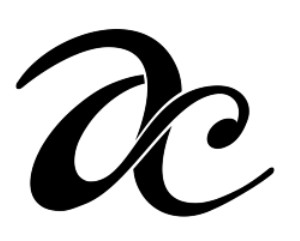

# AutoCaption



Give us an image and we will give you a "catchy" caption for it.Build on .Net and model trained on keras. Easy to use and fun.
## 

# Clone this repository 

```
git clone https://github.com/AadharT/Image-Captioning-UI
```
# Dependencies

You need to install TensorFlow and Keras for ML magic stuff.
```
features.pkl - https://drive.google.com/file/d/1-06BmzIQQYLwHUrLd7vfICVPPBKPNemu/view
model_19.h5 - Coming soon
```

# Usage

In the root folder paste the following dependencies.
```
features.pkl - https://drive.google.com/file/d/1-06BmzIQQYLwHUrLd7vfICVPPBKPNemu/view
model_19.h5 - Coming soon
```
Run the exe file.
Make sure python is added to your path environment variables.
